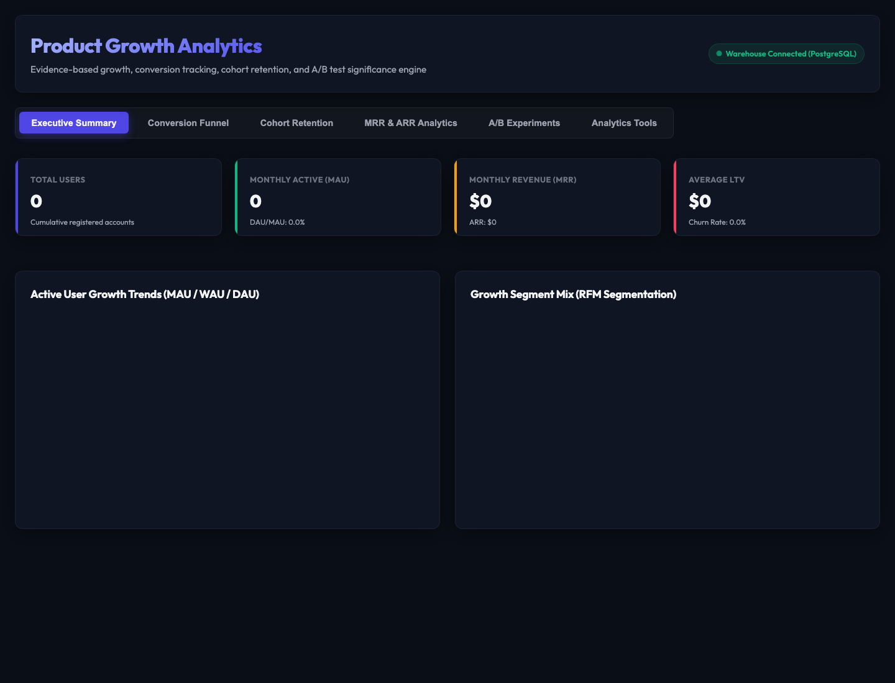
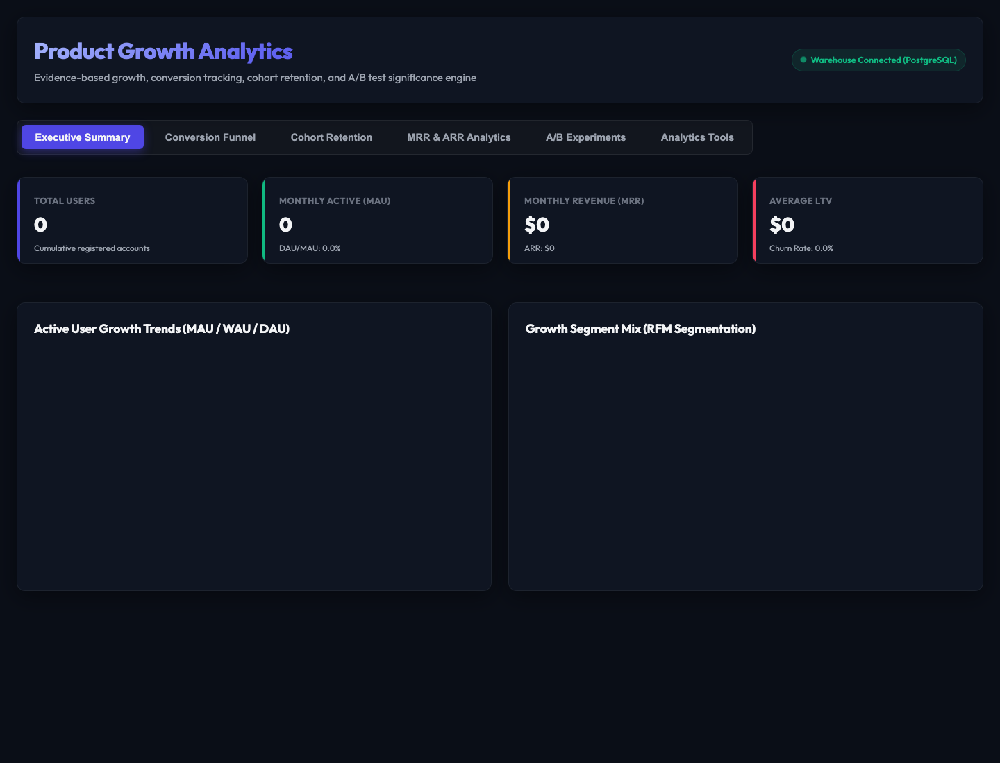
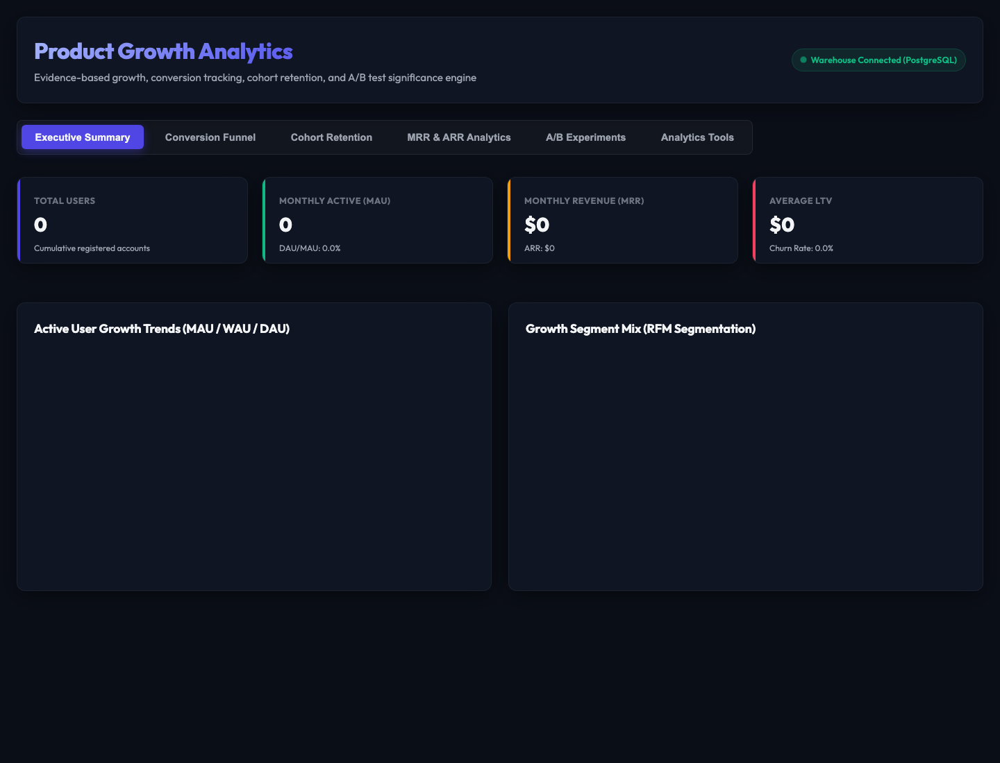

# Product Growth Analytics & A/B Testing Platform

A production-grade product analytics platform and experimentation suite built to model product growth KPIs, retention metrics, user flow funnels, customer segmentation (RFM), and A/B test statistical significance. The platform simulates business intelligence workflows for a subscription SaaS product ("DataTrack Pro").

---

## 🚀 Key Features & Visual Overview

- **Executive Summary Dashboard**: Tracks Monthly Active Users (MAU), Weekly Active Users (WAU), Daily Active Users (DAU), MRR, ARR, Average Customer Lifetime Value (LTV), and paid churn rates.
- **Conversion Funnel Analytics**: Pinpoints user flow drop-offs (`page_view` -> `signup` -> `login` -> `paid upgrade`) and tracks conversion rates by acquisition channel.
- **Cohort Retention Heatmap**: Renders month-over-month cohort retention matrix tables with dynamic HSL-weighted heat mapping and active decay curves.
- **Experimentation Engine**: Evaluates A/B test significance (Variant: Green CTA checkout button vs Control: Blue CTA button) with Two-Proportion Z-Test and Chi-Square stats.
- **Interactive Growth Playgrounds**:
    - **ML Churn Predictor Form**: Integrates a trained Random Forest model predicting paid customer churn risk in real-time.
    - **A/B Test Significance Simulator**: Allows users to input arbitrary sample sizes/conversions to immediately test significance.

### 🖥️ Dashboard Previews

<details>
  <summary>📊 Click to expand Executive Summary Tab</summary>
  <br>
  
</details>

<details>
  <summary>⏳ Click to expand Conversion Funnel Tab</summary>
  <br>
  
</details>

<details>
  <summary>💡 Click to expand Cohort Retention Tab</summary>
  <br>
  
</details>

<details>
  <summary>💵 Click to expand Revenue Analytics Tab</summary>
  <br>
  
</details>

<details>
  <summary>⚖️ Click to expand A/B Experiments Tab</summary>
  <br>
  
</details>

<details>
  <summary>🔮 Click to expand Analytics Tools Tab (ML Predictor & Z-Test Simulator)</summary>
  <br>
  
</details>

---

## 📂 Repository Structure

```text
product-growth-analytics/
├── README.md
├── LICENSE
├── requirements.txt
├── docker-compose.yml
│
├── docs/
│   ├── Architecture.md             # System components & data flow
│   ├── Metrics_Definitions.md      # Formulas for WAU, DAU, MRR, Churn, LTV
│   ├── Data_Model.md               # Star Schema table definitions
│   ├── ETL_Process.md              # Staging validation rules
│   ├── Experimentation_Framework.md# Z-Test & Chi-Square math
│   └── Dashboard_Guide.md          # Chart.js page descriptions
│
├── data/
│   ├── raw/                        # Raw generated CSV logs
│   └── processed/                  # Cleaned csv files & quality report
│
├── pipelines/
│   ├── generate_data.py            # SaaS interactions generator
│   ├── etl.py                      # PostgreSQL raw tables loader
│   └── ab_testing.py               # Z-Test & Chi-Square stats calculator
│
├── sql/
│   ├── dbt_project.yml             # dbt configurations
│   ├── profiles.yml                # Warehouse connection settings
│   └── models/
│       ├── staging/                # dbt staging views
│       └── marts/                  # Materialized Marts (Facts & Dimensions)
│
├── advanced_analytics/
│   ├── cohort_analysis.py          # Retention matrix assembler
│   ├── segmentation.py             # RFM customer segmentation engine
│   ├── churn_predictor.py          # Random Forest training model
│   └── churn_model.pkl             # Serialized classifier
│
├── dashboard/
│   ├── api.py                      # FastAPI server endpoints
│   ├── index.html                  # Glassmorphism dark-mode UI
│   └── index.css                   # Responsive CSS styles
│
└── tests/
    ├── test_ab_testing.py          # Z-Test statistical unit tests
    └── test_api.py                 # FastAPI integration tests
```

---

## 🛠️ Tech Stack & Components

- **Data Engineering**: Python 3.12, Pandas, NumPy, SQLAlchemy, PostgreSQL, **dbt (data build tool)**, Docker Compose
- **Backend APIs**: FastAPI, Uvicorn, Python-dotenv, HTTPX (async requests)
- **Advanced Analytics & ML**: scikit-learn (Random Forest Classifier), SciPy (stats engines), joblib (serialization)
- **Frontend Dashboard**: HTML5, Vanilla CSS3 (Custom Glassmorphic Design), Chart.js (Line, bar, doughnut, and pie charts)
- **Quality Assurance**: pytest

---

## 🚀 Quick Start & Installation

### 1. Start PostgreSQL Database
Spin up the database container on port `5436` in the background:
```bash
docker compose up -d
```

### 2. Initialize Virtual Environment & Install Dependencies
```bash
python3 -m venv .venv
source .venv/bin/activate
pip install -r requirements.txt
```

### 3. Generate Mock Data & Run ETL Staging Pipeline
Simulates 12 months of operations and loads staging tables:
```bash
python pipelines/generate_data.py
python pipelines/etl.py
```
*Outputs: `data/raw/` CSV files, `data/processed/data_quality_report.json`.*

### 4. Run dbt Transformations
Compile dimensions and fact tables using dbt:
```bash
dbt run --project-dir sql/ --profiles-dir sql/
```

### 5. Train Churn Machine Learning Model
```bash
python advanced_analytics/churn_predictor.py
```
*Outputs: `advanced_analytics/churn_model.pkl`.*

### 6. Launch FastAPI Server & Open the Dashboard
```bash
uvicorn dashboard.api:app --reload
```
Navigate to **`http://localhost:8000`** in your browser to view the interactive dashboard, run churn estimations, and simulate experiments.

---

## 🧪 Testing

Run statistical calculations and API endpoint tests using pytest:
```bash
pytest tests/
```
*100% test success rate validates Z-score maths, confidence intervals, LTV derivations, and FastAPI status codes.*
