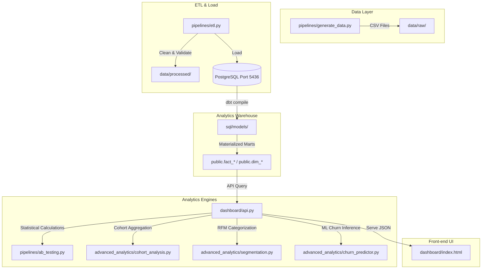

# System Architecture: Product Growth Analytics & A/B Testing Platform

This system is built around a modular modern data stack layout to extract, validate, transform, and analyze SaaS business metrics.

## System Components

1.  **Data Generation Layer**: Generates 12 months of SaaS interaction records containing users, plans, devices, subscriptions, payments, and experiment tracking variables.
2.  **ETL Staging Loader**: Audits raw records, deduplicates, filters invalid payments, creates data quality reports, and inserts rows into PostgreSQL landing tables (`raw_users`, `raw_sessions`, etc.).
3.  **dbt Warehouse Layer**: Structures PostgreSQL tables into a dimensional **Star Schema** separating facts (`fact_sessions`, `fact_events`, `fact_payments`) and dimensions (`dim_users`, `dim_dates`, `dim_plans`, `dim_variants`).
4.  **Advanced Analytics Engines**:
    *   **ab_testing.py**: Computes Two-Proportion Z-Test metrics (lift, p-value, margin of error).
    *   **cohort_analysis.py**: Computes monthly retention percentages.
    *   **segmentation.py**: Classifies users into RFM groups (Power, Loyal, At-Risk, Hibernating).
    *   **churn_predictor.py**: Estimates customer churn probability using Random Forest.
5.  **FastAPI Backend Server**: Exposes structured API endpoints for UI ingestion and simulators.
6.  **Interactive Web Dashboard**: Beautiful Glassmorphism dark-mode UI with dynamic Chart.js visualizations, cohort matrices, ML risk forms, and live experiment calculators.
